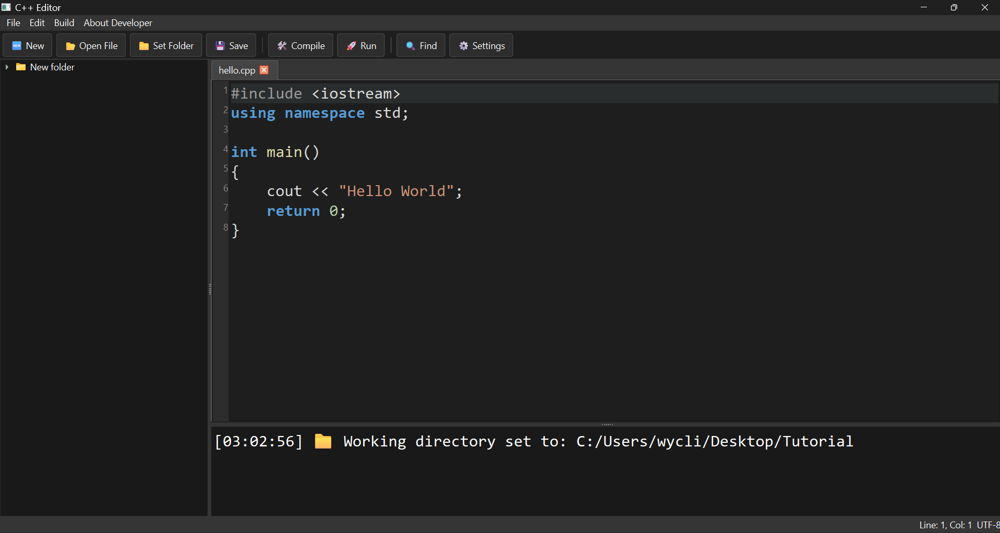
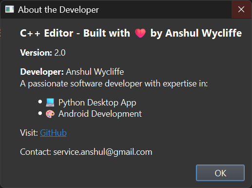
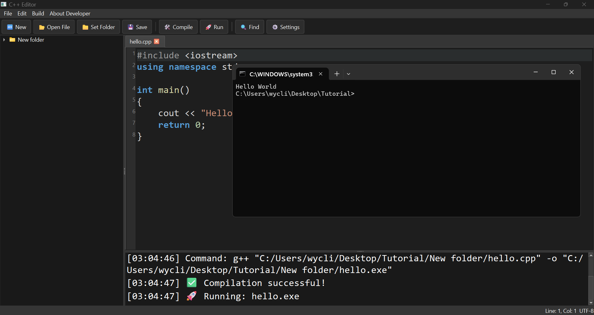

# 🧠 CppEditor – Modern C++ Code Editor

CppEditor is a lightweight, VS Code–style C++ code editor built using Python and PySide6. It offers a modern UI, syntax highlighting, file tree, multi-tab editing, theme switching, compiler support, and persistent workspace.

 <!-- optional screenshot -->



---

## 🚀 Features

- 📄 **Multi-Tab C++ Editor**
- 📁 **File Tree** – View and manage your files
- 🎨 **Dark Theme**
- 🔍 **Find & Replace**
- 🧠 **Syntax Highlighting**
- 🧾 **Persistent Sessions** – Reopen last opened files and folder
- ⚙️ **Build Settings** – Choose compiler (`g++`, `clang++`, `cl`), flags, and auto-run
- 🛠️ **Compile & Run** support with CMD integration
- 🧰 **Right-click File Tree Tools** – Add, Delete, Rename files/folders
- 🧑‍💻 **About Developer** Dialog

---

## 📦 Requirements

- Python 3.10+ (Recommended: 3.12)
- `PySide6`
- `PyInstaller` (for building .exe)

Install with:

```bash
pip install -r requirements.txt
